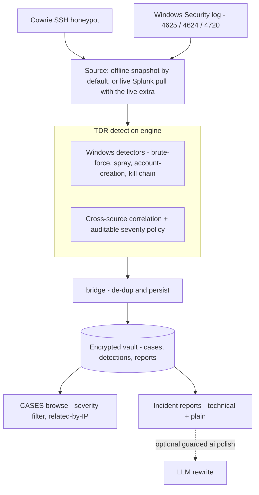

# P.A.N.D.A

[](https://github.com/MukeshKumarC-0309/P.A.N.D.A/actions/workflows/tests.yml)

A local-first **security platform** in Python. One product, two capabilities
on one hardened core:

- **Vault** — an encrypted, per-device store behind a bcrypt-hashed password.
  Data is unreadable at rest and never written to disk in the clear.
- **TDR** (Threat Detection & Response) — a detection engine that turns
  honeypot + Windows Security telemetry into confidence-graded incident cases,
  persisted into the vault as encrypted evidence.

The whole thing runs **offline and deterministic by default** — no network, no
API key. Two opt-in extras add an LLM report polish (`[ai]`) and a live Splunk
pull (`[live]`); with neither installed, PANDA is fully functional on the
bundled offline snapshot.

## Architecture



## Quickstart

```bash
pip install -e .
panda          # or: python main.py
```

No configuration required. On first run PANDA creates an encrypted vault at
`~/.panda/vault.db`; set a password and your records are encrypted under it.

At the prompt:

- `TDR` — scan the telemetry and persist findings as encrypted cases.
- `CASES` — browse stored cases, filter by severity, open detections and reports.
- `VAULT` — open the record system. `SET` / `CHANGE` — manage the password.
- `HELP`, `QUIT`.

`TDR` runs on the offline snapshot by default; `TDR LIVE` pulls from Splunk when
the `[live]` extra is installed and configured (else it says so and falls back
to the snapshot).

## Example run

A scan over the bundled snapshot (real output). The engine finds a confirmed
multi-stage intrusion, a separate brute-force, three account creations, and a
cross-source correlation — de-duplicating what one incident already covers:

```text
YOU : tdr
P.A.N.D.A : Enter your password - ****
------------------------------------------------------------
P.A.N.D.A TDR : scan complete
------------------------------------------------------------
 Source               : snapshot
 Cases persisted      : 6
   kill chains        : 1
   brute/spray        : 1
   account creations  : 3
   correlations       : 1
 Detections           : 8
 Reports              : 3 — deterministic (AI extra not installed)
 Skipped (subsumed by a chain) : 0 brute/spray, 1 account creation(s)
------------------------------------------------------------
P.A.N.D.A : Use the CASES command to browse them.
```

Opening the kill-chain case (`CASES` → case 1) shows its three stitched stages,
and — the payoff of the de-dup design — links the *other* cases that share the
attacker's IP, so one actor's separate lines of evidence connect without being
merged:

```text
Related cases (same source IP 10.0.2.3):
+-----------+-----------------------------------------+------------+
|   Case ID | Title                                   | Severity   |
+===========+=========================================+============+
|         2 | Cross-source correlation: 10.0.2.3 (SSH | medium     |
|           | honeypot + Windows)                     |            |
+-----------+-----------------------------------------+------------+
|         3 | Brute-force from 10.0.2.3               | high       |
+-----------+-----------------------------------------+------------+
```

<!-- TODO (visibility): record a terminal GIF of `tdr` -> `cases` and embed it at the top of this section. -->

## How TDR works

A scan (`panda/bridge.py`) runs a set of detectors over the telemetry and
persists each finding as a case with detections and reports:

- **Windows detectors** (stdlib) — brute-force / password-spray on failed
  logons (4625), account creation (4720), and a multi-stage **kill chain**
  that stitches failed → successful (4624) → persistence into one confirmed
  intrusion, with a technical and a plain-language incident report.
- **Cross-source correlation** (pandas) — joins the Cowrie SSH honeypot against
  Windows failed logons on source IP (and a username fallback), grades severity,
  and renders an analyst alert card.

Severity is a **fixed, auditable policy**, encoded as a shallow decision tree
(scikit-learn) for a readable rule path — *not* a model learned from real attack
data. Every fact traces to the source events, and the reports state their honest
limits plainly (see the model caveat in [DECISIONS.md](DECISIONS.md)).

**ML methodology (separate, synthetic).** Production scoring stays deterministic
on purpose; as a distinct exercise, `panda_tdr/severity_experiment.py`
demonstrates the ML methodology on a *synthetic* dataset with realistic feature
correlations and **injected label noise** (so perfect accuracy is impossible and
the held-out score is meaningful). It does a stratified train/test split and
reports honest metrics — test accuracy vs. a majority baseline, macro-F1, a
confusion matrix, feature importances, and the train-vs-test generalization gap:

```bash
python -m panda_tdr.severity_experiment
```

The claim is deliberately narrow: it shows sound methodology (train/test
discipline, class imbalance, interpretability) on synthetic data — **not**
real-world detection accuracy, which would need real labeled incidents.

### One incident, one case — linked by source IP

Findings are **de-duplicated within a subsystem** (a standalone Windows
detection the kill chain already contains is skipped) but **never across
sensors**: the cross-source correlation is a different claim from a different
sensor than the Windows-only chain, so it stays its own case. When they share a
source IP, opening one case surfaces the others under **Related cases (same
source IP)** — the intended way to connect independent lines of evidence on one
actor, without double-counting.

## Case store (encrypted evidence)

TDR findings live in the same encrypted vault, so they inherit its
encryption-at-rest and login gate:

- **`cases`** — an incident: title, severity, graded confidence, status, shared
  source IP, summary.
- **`detections`** — the individual signals (rule, source, severity,
  confidence, IP, username, evidence).
- **`reports`** — the write-up, one row per audience (`technical`, `plain`).

`detections` and `reports` are foreign-keyed to `cases` (an orphan is
rejected). A scan writes with `cases.record_case` / `record_detection` /
`record_report` (the DB assigns ids); browsing is read-only and only inside an
unlocked vault, so evidence is readable only after login by construction.

> Note: a scan **appends** — re-running `TDR` writes the findings again.
> Idempotency is a planned refinement; with the fixed snapshot this is a demo
> artifact, not a risk.

## Core vs. optional extras

The core is offline and lightweight. The extras are strictly opt-in and never
weaken the core — each degrades to the deterministic path when absent.

| Install | Adds | Needs |
| --- | --- | --- |
| `pip install -e .` (core) | vault + full deterministic TDR engine, offline | — |
| `pip install -e '.[ai]'` | LLM-polished report **wording** | `crewai` + `GEMINI_API_KEY` |
| `pip install -e '.[live]'` | live Splunk pull instead of the snapshot | `splunk-sdk` + `SPLUNK_*`, Splunk reachable |

**The deterministic report is always the source of truth.** LLM polish only
rewords it, behind two integrity guards: a whole-card guard (rejects LaTeX, a
dropped or fabricated IP, a missing severity word) and a section-level fact
guard on the incident report (reverts any prose section that drops a hard
fact). A polish that fails *or* drifts ships the deterministic text — so an API
hiccup can't crash a run and a bad rewrite can't ship. The plain-language report
is never sent to an LLM. With no extra installed, the run summary reads
*"deterministic (AI extra not installed)"* — the expected default, not a silent
failure.

```bash
# optional, any combination:
pip install -e '.[ai]'      # + set GEMINI_API_KEY
pip install -e '.[live]'    # + set SPLUNK_USER / SPLUNK_PASSWORD / ...
```

## Security design

- **Password hashing — bcrypt** (`panda/auth.py`): salted, deliberately slow;
  never plaintext or a fast unsalted hash.
- **Encrypted vault at rest** (`panda/crypto.py`, `panda/db.py`): on disk the
  vault is only ciphertext — a random salt prepended to a Fernet (AES-CBC +
  HMAC, authenticated) token, keyed from the password via scrypt (memory-hard).
  Unlocking decrypts into an in-memory SQLite DB; locking re-encrypts —
  plaintext never touches the disk. A wrong password or tampered file is
  detected, not silently accepted.
- **Parameterized data access** (`panda/db.py`): values bind as `?` parameters;
  table/column identifiers validate against a strict whitelist — no user input
  is interpolated into SQL.
- **Offline core, no secrets.** Embedded `sqlite3`, one local file per device.
  The only network paths are the opt-in extras.

## Layout

```
PANDA/
├── main.py                # CLI: banner, command loop, security + tdr/cases commands
├── config.py              # local config (vault path); no keys/secrets
├── schema.sql             # cases / detections / reports (FK-enforced)
├── pyproject.toml         # package + deps: core, and [ai] / [live] / [dev] extras
├── DECISIONS.md           # decision record
├── panda/                 # the platform
│   ├── auth.py  crypto.py  db.py      # bcrypt auth, encryption, in-memory DAO
│   ├── router.py  system.py  vault.py # dispatch, console I/O, record system
│   ├── cases.py                       # case-store write/read API
│   ├── browse.py                      # interactive case browse (shared)
│   └── bridge.py                      # scan → detect + correlate → persist
├── panda_tdr/             # the vendored TDR engine (stdlib core + optional layers)
│   ├── detections.py  windows_records.py  incident_report.py   # Windows detectors
│   ├── correlation.py  cowrie_records.py                       # cross-source join
│   ├── severity_model.py  alerting.py  reporter.py             # scoring + alert card
│   ├── severity_experiment.py                                  # synthetic ML methodology demo (not production)
│   ├── snapshot.py                                             # offline source
│   ├── polish.py  polish_guard.py  incident_polish.py  llm.py  crews/  # [ai]
│   └── live.py  splunk_client.py  windows_source.py  cowrie_source.py  # [live]
├── test_data/             # offline Splunk snapshot fixture
└── tests/                 # pytest suite (see below)
```

## Tests

```bash
pip install -e '.[dev]'
pytest
```

The suite runs fully offline (no crewai, no Splunk): the encryption round-trip
(wrong-password rejection, tamper detection, no-plaintext-on-disk), the
data-access layer (CRUD + injection), auth and routing, the TDR detectors,
correlation, both LLM-polish integrity guards (with injected fakes), the
live-source availability logic, and the bridge's persist / de-dup / related-case
behavior end to end.

## Notes from the build

<!-- TODO (your voice — a few honest sentences): why you built this, the honeypot
     lab behind it, and what you set out to learn. This is the part reviewers
     remember; keep it real, first-person, and specific to your experience. -->

A few design calls I'd call out:

- **Deterministic first, LLM optional.** The engine produces a correct,
  fact-traceable report on its own; the LLM only ever rewords it, behind
  integrity guards that ship the deterministic text if the rewrite drifts or the
  call fails. The product is fully functional — and honest — with no API key.
- **De-dup within a subsystem, never across sensors.** A standalone Windows
  detection the kill chain already contains is dropped; but a cross-source
  correlation is a *different claim from a different sensor*, so it is never
  merged into the chain. Collapsing it would delete the cross-sensor signal —
  the whole point of correlating. Shared IP links them instead.
- **Honest severity, not fake ML.** Production severity is a fixed, auditable
  policy; the ML angle lives in a clearly-separated synthetic benchmark that
  reports held-out metrics and states plainly what synthetic data can't prove.

**A bug the tests caught.** Before refactoring the interactive shell into a
class, I wrote *characterization tests* to pin its current behavior. They
immediately surfaced a latent crash — column-wrapping tripped `tabulate` on an
empty table, so browsing a fresh vault would have thrown. I fixed it under the
net, then did the refactor knowing behavior was locked. Writing the tests first
paid for itself before the refactor even started.

<!-- TODO (your voice): what you learned, and what's next — e.g. running the
     [live] pull against a larger honeypot capture, or gathering real labeled
     incidents so the severity model can be evaluated for real. -->

## Design record

See [DECISIONS.md](DECISIONS.md) for the reasoning behind the security choices,
the case-store mapping, the de-dup principle, the offline-core / opt-in-extras
split, and the honest model caveat on the severity tree.

## License

MIT — see [LICENSE](LICENSE).
